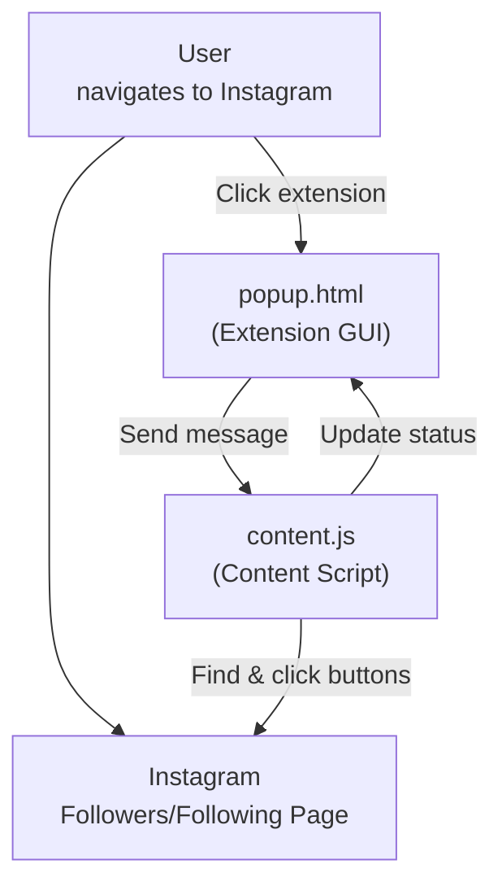
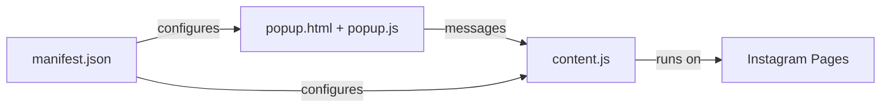

# 📸 Instagram Bot - Chrome Extension


A Chrome extension for Instagram automation that works directly in your browser. Follow users in batches and unfollow them selectively using search-based detection. **Now with intelligent private account detection!**

---

## 🚀 Why Chrome Extension? (Design Choices)

- **Natural Integration:** Works with your existing Instagram session - no separate login needed
- **Real Browser Session:** Uses your actual Chrome browser, making actions appear completely natural
- **Manual Control:** You navigate to the pages you want to automate, giving you full control
- **No Detection:** Since it uses your real browser session and you manually navigate, it's virtually undetectable
- **Smart Account Detection:** Automatically detects and skips private accounts, only following public accounts
- **Simple Setup:** Just install the extension and you're ready to go
- **Privacy First:** No data ever leaves your browser, everything runs locally

---

## 🛠️ How It Works

### Smart Account Detection

The extension now **intelligently distinguishes between public and private accounts**:

1. **Follow Button Analysis:** Monitors button state changes after clicking "Follow"
2. **Public Account Detection:** If button changes to "Following" → Account is public and successfully followed ✅
3. **Private Account Detection:** If button changes to "Requested" → Account is private, automatically unfollowed 🔄
4. **Automatic Cleanup:** Private account follow requests are immediately removed to maintain clean account status
5. **Accurate Counting:** Only public accounts count toward your follow goal

### Batch-Based System

The extension uses a **batch-based approach** for better organization and control:

1. **Follow Sessions:** Each follow session creates a new batch with timestamp
2. **Public Account Storage:** Only successfully followed public accounts are stored in batches
3. **Selective Unfollow:** Choose specific batches to unfollow instead of all users
4. **Search-Based Unfollow:** Uses Instagram's search to find specific users efficiently

### Chrome Extension Workflow

1. **Install the Extension:** Load the extension into Chrome
2. **Navigate to Instagram:** Log into Instagram normally in your browser
3. **Go to Target Page:**
   - **For Following:** Navigate to any user's followers page
   - **For Unfollowing:** Navigate to your own following page
4. **Open Extension:** Click the extension icon in Chrome
5. **Follow/Unfollow:** Enter count to follow or select batch to unfollow
6. **Automated Actions:** The extension performs the actions with smart delays and private account detection

---

## 🗂️ File & Component Overview

- `manifest.json` — Chrome extension configuration
- `popup.html` — Extension popup interface (vintage Windows style)
- `popup.js` — Popup logic and user interface handling
- `content.js` — Content script that runs on Instagram pages and performs automation

---

## 🔄 Information Flow



---

## 🧩 Component Relationships



---

## 🖥️ How to Use

### Installation

1. **Download/Clone this repository**
2. **Open Chrome and go to:** `chrome://extensions/`
3. **Enable "Developer mode"** (toggle in top right)
4. **Click "Load unpacked"** and select this project folder
5. **The extension icon will appear** in your Chrome toolbar

### Usage

1. **Login to Instagram** in Chrome normally
2. **Navigate to the target page:**
   - **To Follow:** Go to any user's profile → Click "followers"
   - **To Unfollow:** Go to your own profile → Click "following"
3. **Click the extension icon** in Chrome toolbar
4. **The popup will detect the page type** and show appropriate options
5. **Follow:** Enter number of users to follow (1-50) → Click "START FOLLOWING"
6. **Unfollow:** Select a batch from dropdown → Click "START UNFOLLOWING"
7. **Monitor progress** in the status area

---

## ⚙️ Technical Details

### Smart Follow Logic
- **Context Aware:** Automatically detects if you're on followers (follow) or following (unfollow) page
- **Private Account Detection:** Monitors button state changes to distinguish public vs private accounts
- **Button State Analysis:** 
  - "Follow" → "Following" = Public account successfully followed ✅
  - "Follow" → "Requested" = Private account, automatically unfollowed 🔄
- **Automatic Cleanup:** Removes private account follow requests immediately
- **Batch Creation:** Each follow session creates a new batch with timestamp
- **Exact Count:** Follows exactly the number of public accounts you specify
- **Smart Scrolling:** Automatically scrolls to find more users if needed
- **Random Delays:** 0.7-2.5 second delays between each action
- **Username Storage:** Saves only public account usernames to batches for later unfollowing

### Unfollow Logic
- **Search-Based Detection:** Uses Instagram's search to find specific users
- **Batch Selection:** Choose which batch to unfollow from dropdown
- **Smart Timing:** 1-2.5s search delay + 1-2s click delay + 0.7-2.5s between users
- **Complete Batch Processing:** Unfollows entire selected batch automatically
- **Automatic Cleanup:** Removes empty batches after unfollowing

### Page Detection
- **Followers Page:** Shows "Follow Users" option with private account detection
- **Following Page:** Shows "Unfollow Users" option with batch selection
- **Other Pages:** Shows navigation instructions

### Safety Features
- **Session Management:** Uses your real browser session (no separate login)
- **Manual Navigation:** You control which pages to automate
- **Rate Limiting:** Multiple random delays to prevent Instagram rate limits
- **Private Account Filtering:** Automatically skips private accounts to avoid pending requests
- **Status Updates:** Real-time feedback on progress including private account handling
- **Error Handling:** Graceful handling of missing elements or Instagram changes
- **Batch Organization:** Prevents accidentally unfollowing wrong users
- **Clean Account Status:** No pending follow requests from private accounts

---

## 📦 Extension Structure

### Files
- `manifest.json` - Extension permissions and configuration
- `popup.html` - User interface with vintage Windows styling
- `popup.js` - Interface logic and Chrome extension messaging
- `content.js` - Instagram page automation logic

### Permissions
- `activeTab` - Access to current Instagram tab
- `storage` - Save extension settings (if needed)

---

## 🔍 Private Account Detection Feature

### What It Does
The extension now **intelligently detects the difference between public and private Instagram accounts** during follow operations, ensuring you only follow public accounts while automatically handling private accounts.

### How It Works
1. **Button State Monitoring:** After clicking "Follow", the extension monitors button text changes
2. **Public Account Detection:** 
   - Button changes from "Follow" → "Following"
   - Account is successfully followed and added to batch
   - Counts toward your follow goal ✅
3. **Private Account Detection:**
   - Button changes from "Follow" → "Requested" 
   - Account is automatically unfollowed immediately
   - Not added to batch, doesn't count toward goal 🔄

### Benefits
- **No Pending Requests:** Private account follow requests are automatically removed
- **Clean Account Status:** Your Instagram account stays clean with no pending requests
- **Accurate Follow Counts:** Only public accounts count toward your follow target
- **Better Instagram Health:** Avoids accumulating pending requests that can hurt account reputation
- **Automatic Cleanup:** No manual intervention needed for private accounts

### Example Workflow
```
User clicks "Follow" on @user123
↓
Extension waits 1.5 seconds for button update
↓
Button shows "Following" → Public account ✅
OR
Button shows "Requested" → Private account, auto-unfollowed 🔄
```

---

## ⚠️ Important Notes

- **Manual Navigation Required:** You must manually navigate to the Instagram page you want to automate
- **Real Session:** Uses your actual Instagram login session
- **Rate Limits:** Instagram may still apply rate limits for excessive actions
- **Page Refresh:** If Instagram refreshes the page, just reopen the extension
- **Browser Required:** Must use Chrome browser with extension installed

---

## 🚨 Usage Instructions

### To Follow Users:
1. Go to any Instagram user's profile
2. Click "followers" to open the followers list
3. Click the extension icon
4. Enter number to follow and click "START FOLLOWING"
5. The extension automatically detects public vs private accounts:
   - **Public accounts:** Successfully followed and added to batch ✅
   - **Private accounts:** Automatically skipped and not added to batch 🔄
6. A new batch is created with only the successfully followed public accounts

### To Unfollow Users:
1. Go to your own Instagram profile  
2. Click "following" to open your following list
3. Click the extension icon
4. Select a batch from the dropdown
5. Click "START UNFOLLOWING" to unfollow entire batch
6. The extension searches for each user and unfollows them

### Private Account Handling:
- **Automatic Detection:** The extension monitors button state changes after clicking "Follow"
- **Public Accounts:** Button changes to "Following" → Account is followed and stored
- **Private Accounts:** Button changes to "Requested" → Account is automatically unfollowed
- **Clean Status:** No pending follow requests accumulate from private accounts
- **Accurate Counts:** Only public accounts count toward your follow goal

---

## 🛡️ Safety & Detection

- **Undetectable:** Uses your real browser session and manual navigation
- **Natural Timing:** Multiple random delays mimic human behavior
- **Smart Account Filtering:** Automatically detects and skips private accounts
- **No Pending Requests:** Private account follow requests are immediately removed
- **Search-Based:** Uses Instagram's own search functionality
- **Batch Organization:** Prevents accidentally unfollowing wrong users
- **Rate Limit Aware:** Stops if Instagram blocks actions
- **Manual Override:** You can stop automation at any time by closing the popup
- **Clean Account Status:** Maintains clean Instagram account with no pending requests
- **Accurate Follow Counts:** Only counts actual public account follows, not pending requests

---

## ⚠️ Disclaimer

This tool is for educational and personal use only. Use responsibly and in accordance with Instagram's terms of service. The extension works with your real Instagram account, so exercise caution with the number of actions performed. 