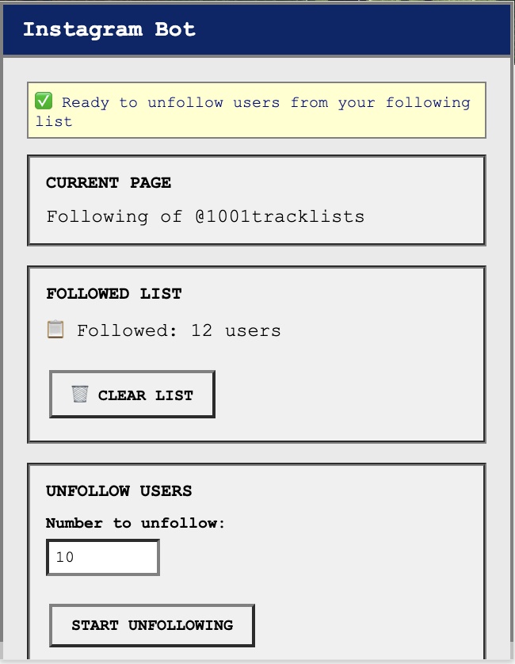
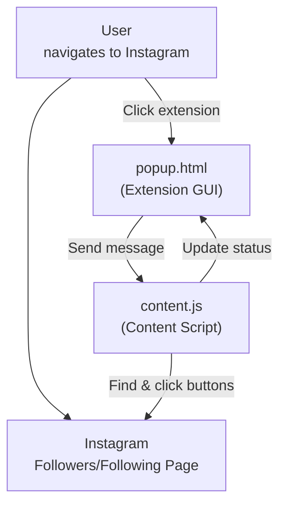
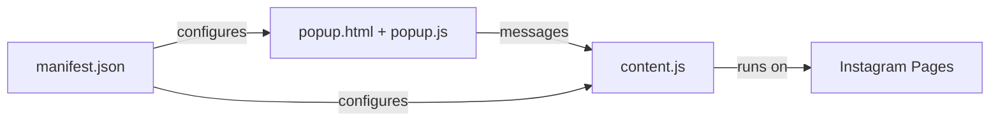

# 📸 Instagram Bot - Chrome Extension

A Chrome extension for Instagram automation that works directly in your browser. Follow users in batches and unfollow them selectively using search-based detection.

---

## 🚀 Why Chrome Extension? (Design Choices)

- **Natural Integration:** Works with your existing Instagram session - no separate login needed
- **Real Browser Session:** Uses your actual Chrome browser, making actions appear completely natural
- **Manual Control:** You navigate to the pages you want to automate, giving you full control
- **No Detection:** Since it uses your real browser session and you manually navigate, it's virtually undetectable
- **Simple Setup:** Just install the extension and you're ready to go
- **Privacy First:** No data ever leaves your browser, everything runs locally

---

## 🛠️ How It Works

### Batch-Based System

The extension uses a **batch-based approach** for better organization and control:

1. **Follow Sessions:** Each follow session creates a new batch with timestamp
2. **Batch Storage:** Usernames are stored in batches with creation timestamps
3. **Selective Unfollow:** Choose specific batches to unfollow instead of all users
4. **Search-Based Unfollow:** Uses Instagram's search to find specific users efficiently

### Chrome Extension Workflow

1. **Install the Extension:** Load the extension into Chrome
2. **Navigate to Instagram:** Log into Instagram normally in your browser
3. **Go to Target Page:**
   - **For Following:** Navigate to any user's followers page
   - **For Unfollowing:** Navigate to your own following page
4. **Open Extension:** Click the extension icon in Chrome
5. **Follow/Unfollow:** Enter count to follow or select batch to unfollow
6. **Automated Actions:** The extension performs the actions with smart delays

---

## 🗂️ File & Component Overview

- `manifest.json` — Chrome extension configuration
- `popup.html` — Extension popup interface (vintage Windows style)
- `popup.js` — Popup logic and user interface handling
- `content.js` — Content script that runs on Instagram pages and performs automation

---

## 🔄 Information Flow

---

## 🧩 Component Relationships

---

## 🖥️ How to Use

### Installation

1. **Download/Clone this repository**
2. **Open Chrome and go to:** `chrome://extensions/`
3. **Enable "Developer mode"** (toggle in top right)
4. **Click "Load unpacked"** and select this project folder
5. **The extension icon will appear** in your Chrome toolbar

### Usage

1. **Login to Instagram** in Chrome normally
2. **Navigate to the target page:**
   - **To Follow:** Go to any user's profile → Click "followers"
   - **To Unfollow:** Go to your own profile → Click "following"
3. **Click the extension icon** in Chrome toolbar
4. **The popup will detect the page type** and show appropriate options
5. **Follow:** Enter number of users to follow (1-50) → Click "START FOLLOWING"
6. **Unfollow:** Select a batch from dropdown → Click "START UNFOLLOWING"
7. **Monitor progress** in the status area

---

## ⚙️ Technical Details

### Follow Logic
- **Context Aware:** Automatically detects if you're on followers (follow) or following (unfollow) page
- **Batch Creation:** Each follow session creates a new batch with timestamp
- **Exact Count:** Follows exactly the number you specify
- **Smart Scrolling:** Automatically scrolls to find more users if needed
- **Random Delays:** 0.7-2.5 second delays between each action
- **Username Storage:** Saves usernames to batches for later unfollowing

### Unfollow Logic
- **Search-Based Detection:** Uses Instagram's search to find specific users
- **Batch Selection:** Choose which batch to unfollow from dropdown
- **Smart Timing:** 1-2.5s search delay + 1-2s click delay + 0.7-2.5s between users
- **Complete Batch Processing:** Unfollows entire selected batch automatically
- **Automatic Cleanup:** Removes empty batches after unfollowing

### Page Detection
- **Followers Page:** Shows "Follow Users" option
- **Following Page:** Shows "Unfollow Users" option with batch selection
- **Other Pages:** Shows navigation instructions

### Safety Features
- **Session Management:** Uses your real browser session (no separate login)
- **Manual Navigation:** You control which pages to automate
- **Rate Limiting:** Multiple random delays to prevent Instagram rate limits
- **Status Updates:** Real-time feedback on progress
- **Error Handling:** Graceful handling of missing elements or Instagram changes
- **Batch Organization:** Prevents accidentally unfollowing wrong users

---

## 📦 Extension Structure

### Files
- `manifest.json` - Extension permissions and configuration
- `popup.html` - User interface with vintage Windows styling
- `popup.js` - Interface logic and Chrome extension messaging
- `content.js` - Instagram page automation logic

### Permissions
- `activeTab` - Access to current Instagram tab
- `storage` - Save extension settings (if needed)

---

## ⚠️ Important Notes

- **Manual Navigation Required:** You must manually navigate to the Instagram page you want to automate
- **Real Session:** Uses your actual Instagram login session
- **Rate Limits:** Instagram may still apply rate limits for excessive actions
- **Page Refresh:** If Instagram refreshes the page, just reopen the extension
- **Browser Required:** Must use Chrome browser with extension installed

---

## 🚨 Usage Instructions

### To Follow Users:
1. Go to any Instagram user's profile
2. Click "followers" to open the followers list
3. Click the extension icon
4. Enter number to follow and click "START FOLLOWING"
5. The extension creates a new batch with timestamp

### To Unfollow Users:
1. Go to your own Instagram profile  
2. Click "following" to open your following list
3. Click the extension icon
4. Select a batch from the dropdown
5. Click "START UNFOLLOWING" to unfollow entire batch
6. The extension searches for each user and unfollows them

---

## 🛡️ Safety & Detection

- **Undetectable:** Uses your real browser session and manual navigation
- **Natural Timing:** Multiple random delays mimic human behavior
- **Search-Based:** Uses Instagram's own search functionality
- **Batch Organization:** Prevents accidentally unfollowing wrong users
- **Rate Limit Aware:** Stops if Instagram blocks actions
- **Manual Override:** You can stop automation at any time by closing the popup

---

## ⚠️ Disclaimer

This tool is for educational and personal use only. Use responsibly and in accordance with Instagram's terms of service. The extension works with your real Instagram account, so exercise caution with the number of actions performed. 