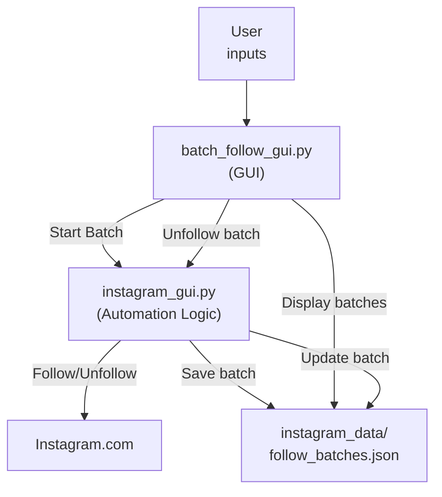
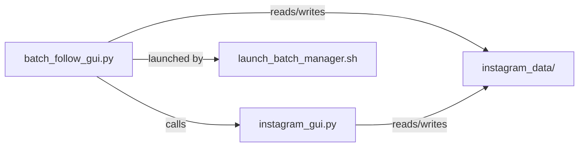

# 📸 Insta Bot - Vintage GUI Edition


A local, privacy-first Instagram automation tool with a retro Windows-style interface. This bot allows you to safely grow and manage your Instagram account by following and unfollowing users in batches, with full anti-detection logic and batch tracking.

---

## 🚀 Why Local? (Design Choices)

- **Privacy & Security:** Your Instagram credentials and data never leave your device. No cloud, no server, no risk of leaks.
- **Control:** You decide when and how the bot runs. No background daemons or 24/7 server processes.
- **Simplicity:** No server setup, no port forwarding, no cloud costs. Just run the app on your own computer.
- **Stealth:** Local operation means you can use your own IP, proxies, and browser for maximum anti-detection.

---

## 🛠️ How It Works

### Current Configuration

1. **Launch the GUI:** Run `batch_follow_gui.py` to open the vintage-style interface
2. **Configure Settings:**
   - Enter your Instagram username and password
   - Set target accounts (comma-separated)
   - Specify "Follows per Account" (exact number to follow from each target)
   - Choose whether to show the browser during automation
3. **Start a Batch:**
   - Click "START NEW BATCH" to begin following
   - The bot logs into Instagram using Selenium
   - For each target account, it opens the followers modal
   - Follows exactly the number of users you specified
   - Waits 1 second between each follow action
   - Saves all followed usernames to the batch log
4. **Batch Management:**
   - All batches appear in the "FOLLOW BATCHES" section
   - Each batch shows timestamp, source accounts, and user count
   - Click "Unfollow All" on any batch to unfollow those users
   - Delete unfollowed batches to clean up the interface

---

## 🗂️ File & Component Overview

- `batch_follow_gui.py` — Main GUI application (vintage Windows style)
- `deployment_package/instagram_gui.py` — Core Instagram automation logic
- `instagram_data/` — Local storage for batches and user data
- `launch_batch_manager.sh` — Launcher script for easy startup

---

## 🔄 Information Flow



---

## 🧩 Component Relationships



---

## 🖥️ How to Use

1. **Launch the app:**
```bash
./launch_batch_manager.sh
```

2. **Enter your Instagram login credentials**

3. **Configure your targets:**
   - Target Accounts: Enter usernames separated by commas (e.g., `account1,account2`)
   - Follows per Account: Set the exact number of users to follow from each account

4. **Start following:**
   - Click "START NEW BATCH"
   - The bot will follow exactly the number you specified from each target account
   - Progress is shown in the status log

5. **Manage batches:**
   - View all batches in the "FOLLOW BATCHES" section
   - Click "Unfollow All" on any batch to unfollow those users
   - Use "DELETE UNFOLLOWED BATCHES" to clean up completed batches

---

## ⚙️ Technical Details

### Follow Logic
- **Exact Count:** Follows exactly the number specified in "Follows per Account"
- **No Verification:** Assumes all button clicks are successful (no button text checking)
- **1-Second Delays:** Waits 1 second between each follow action
- **Smart Scrolling:** Automatically scrolls the followers modal to find more users
- **Duplicate Prevention:** Won't follow users already followed in previous sessions

### Batch Management
- **Persistent Storage:** All batches saved to `instagram_data/follow_batches.json`
- **Real-time Updates:** GUI refreshes automatically to show new batches
- **User Tracking:** Each batch contains usernames, follow timestamps, and source accounts
- **Unfollow Support:** One-click unfollow for entire batches

### Anti-Detection Features
- **Randomized Delays:** Built-in delays between actions
- **Browser Options:** Can run headless or visible browser
- **Session Management:** Fresh browser sessions for each batch
- **Error Handling:** Graceful handling of Instagram rate limits and blocks

---

## 📦 Data Storage

- All user, batch, and log data is stored in the `instagram_data/` directory
- No data is ever sent to a remote server
- You can back up or delete your data at any time

---

## ⚠️ Important Notes

- **Rate Limits:** Instagram may temporarily block actions if you follow too many users too quickly
- **Account Safety:** Use reasonable follow counts and take breaks between batches
- **Educational Use:** This tool is for educational and personal use only
- **Terms of Service:** Excessive automation may violate Instagram's terms of service

---

## 🚨 Troubleshooting

- **"Try Again Later" Error:** Instagram has temporarily blocked actions. Wait and try again later.
- **Bot Follows Only One User:** Check that your target accounts have public followers and the bot can access them.
- **Batch Not Appearing:** Check the status log for errors and ensure the batch completed successfully. 