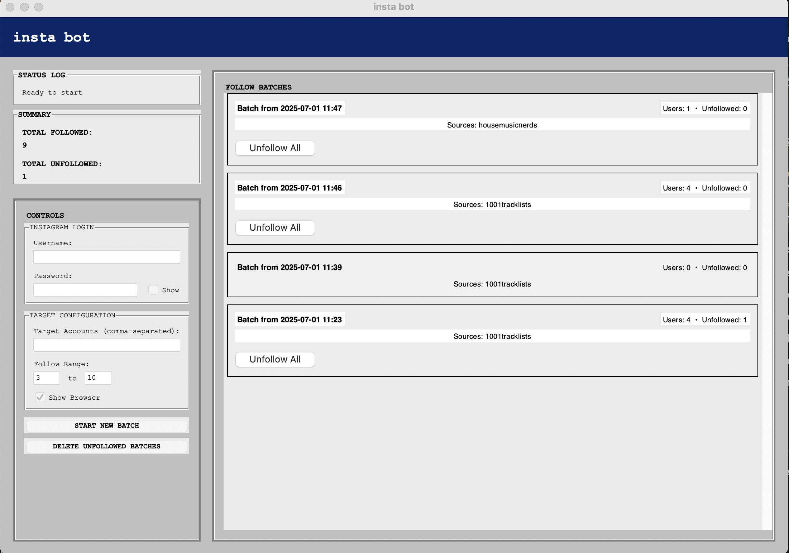
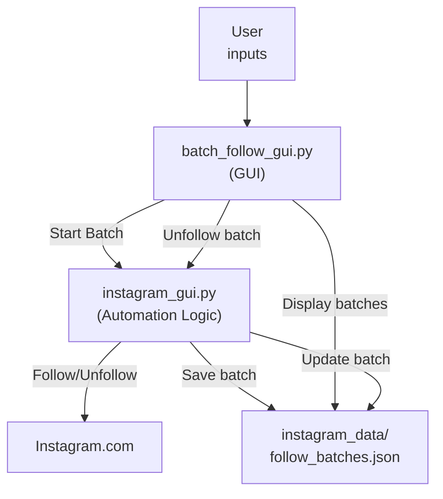
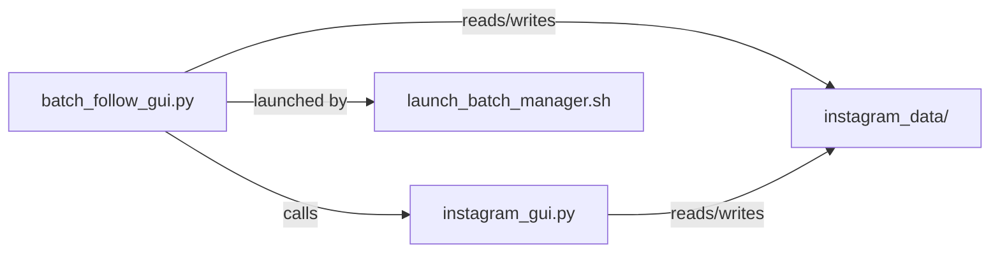

# 📸 Insta Bot - Vintage GUI Edition



A local, privacy-first Instagram automation tool with a retro Windows-style interface. This bot allows you to safely grow and manage your Instagram account by following and unfollowing users in batches, with full anti-detection logic and batch tracking.

---

## 🚀 Why Local? (Design Choices)

- **Privacy & Security:** Your Instagram credentials and data never leave your device. No cloud, no server, no risk of leaks.
- **Control:** You decide when and how the bot runs. No background daemons or 24/7 server processes.
- **Simplicity:** No server setup, no port forwarding, no cloud costs. Just run the app on your own computer.
- **Stealth:** Local operation means you can use your own IP, proxies, and browser for maximum anti-detection.

---

## 🛠️ How It Works

1. **You launch the GUI in terminal** (`~/instabot`)
2. **Enter your Instagram credentials and targets**
3. **Start a batch:**
   - The bot logs in using Selenium automation
   - It scrapes followers from your target accounts
   - Follows a randomized number of users per your settings
   - All actions are delayed and randomized to avoid detection
   - Each batch is saved with a timestamp and user list
4. **Batch Management:**
   - All batches are displayed in the GUI
   - You can unfollow all users from any batch with one click
   - Unfollow actions are also randomized and tracked
5. **Data is stored locally** in `instagram_data/` (never sent to a server)

---

## 🗂️ File & Component Overview

- `batch_follow_gui.py` — Main GUI application (vintage Windows style)
- `instagram_gui.py` — Core Instagram automation logic (follow/unfollow, anti-detection)
- `launch_batch_manager.sh` — Launcher script for easy startup
- `instagram_data/` — Local storage for batches, logs, and user data
- `deployment_package/` — (Optional) Server and legacy files (not needed for local use)

---

## 🔄 Information Flow



---

## 🧩 Component Relationships



---

## 🖥️ How to Use

1. **Launch the app:**
   ```bash
   ~/instabot
   ```
2. **Enter your Instagram login, target accounts, and follow range**
3. **Click "Start New Batch"** to begin following
4. **Monitor batches and status in the GUI**
5. **Click "Unfollow All"** on any batch to unfollow those users
6. **All data is saved locally and can be managed from the GUI**

---

## 📦 Data Storage

- All user, batch, and log data is stored in the `instagram_data/` directory
- No data is ever sent to a remote server
- You can back up or delete your data at any time

---

## ⚠️ Disclaimer

This tool is for educational and personal use only. Use at your own risk. Excessive automation may violate Instagram's terms of service. 