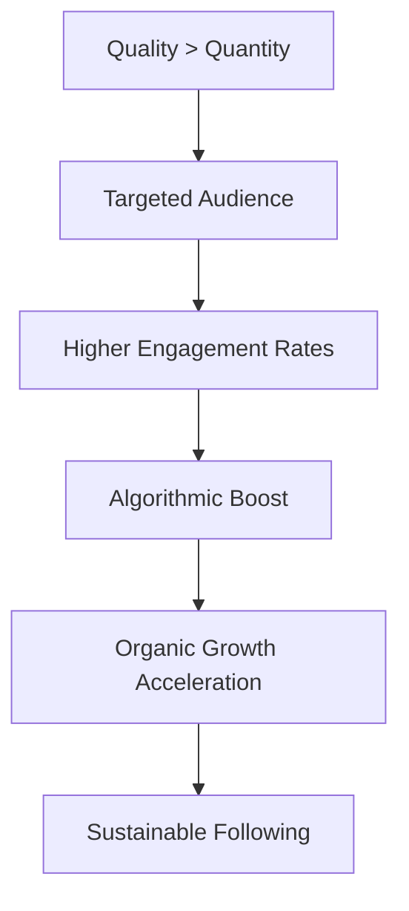
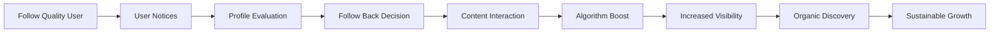
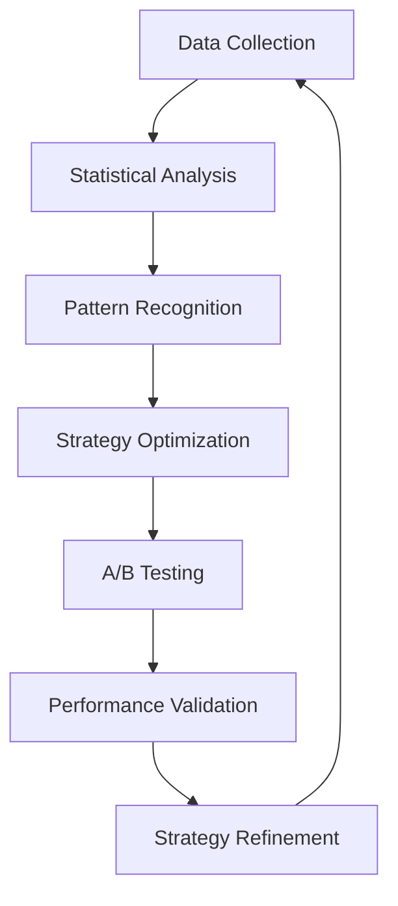

# 🤖 Autonomous Instagram Growth Engine

## 📸 Dashboard Overview

*Real-time web dashboard showing active monitoring, service controls, and comprehensive analytics*

---

## 🎯 Strategic Overview

This Instagram automation system implements a **sophisticated, human-like growth strategy** that leverages behavioral psychology and social proof to achieve sustainable organic growth. Unlike traditional bot approaches that focus on mass actions, this system employs **targeted demographic acquisition** through strategic follower sampling from established accounts.

### 🧠 Core Philosophy



**Key Principle**: By following users who already engage with similar content, we tap into pre-qualified audiences who are statistically more likely to reciprocate and engage authentically.

---

## 🏗️ System Architecture

### 📊 High-Level Architecture Diagram

```
┌─────────────────────────────────────────────────────────────────┐
│                    AUTONOMOUS INSTAGRAM BOT                     │
├─────────────────────────────────────────────────────────────────┤
│  ┌─────────────────┐    ┌─────────────────┐    ┌─────────────────┐  │
│  │   Web Dashboard │    │   Bot Engine    │    │  Data Storage   │  │
│  │                 │    │                 │    │                 │  │
│  │ • Live Monitoring│◄──►│ • Selenium Core │◄──►│ • JSON Database │  │
│  │ • Service Control│    │ • Schedule Mgr  │    │ • Action Logs   │  │
│  │ • Config Management │  │ • Safety Systems│    │ • User Tracking │  │
│  │ • Real-time Logs│    │ • Error Recovery│    │ • Config Store  │  │
│  └─────────────────┘    └─────────────────┘    └─────────────────┘  │
│           │                       │                       │         │
│           └───────────────────────┼───────────────────────┘         │
│                                   │                                 │
│  ┌─────────────────────────────────┼─────────────────────────────────┐  │
│  │                    NOTIFICATION SYSTEM                          │  │
│  │  ┌─────────────────┐    ┌─────────────────┐    ┌─────────────────┐  │
│  │  │ Email Alerts    │    │ Discord Webhooks│    │ Error Reporting │  │
│  │  │ • Daily Reports │    │ • Real-time Updates│ │ • Critical Alerts│ │
│  │  │ • Error Alerts  │    │ • Status Changes│    │ • System Health │  │
│  │  └─────────────────┘    └─────────────────┘    └─────────────────┘  │
│  └─────────────────────────────────────────────────────────────────────┘  │
└─────────────────────────────────────────────────────────────────┘
```

---

## 🔄 Data Flow Architecture

### 📈 Primary Data Flow Diagram

```
┌─────────────────┐
│   User Input    │
│ (Target Accounts│
│  & Parameters)  │
└─────┬───────────┘
      │
      ▼
┌─────────────────┐    ┌─────────────────┐    ┌─────────────────┐
│  Configuration  │───►│   Scheduler     │───►│  Bot Execution  │
│    Validation   │    │   (Cron-like)   │    │   (Selenium)    │
└─────────────────┘    └─────────────────┘    └─────┬───────────┘
                                                    │
                                                    ▼
┌─────────────────┐    ┌─────────────────┐    ┌─────────────────┐
│  Data Storage   │◄───│  Action Logger  │◄───│ Instagram API   │
│ (follows.json)  │    │  (timestamped)  │    │   Interaction   │
└─────────────────┘    └─────────────────┘    └─────────────────┘
         │                       │
         ▼                       ▼
┌─────────────────┐    ┌─────────────────┐
│   Analytics     │    │  Notifications  │
│   Generation    │    │   (Email/Discord)│
└─────────────────┘    └─────────────────┘
```

### 🎯 Follow Cycle Flow

```
START ──► Load Target Account ──► Navigate to Followers
  │                                        │
  │                                        ▼
  │                              Randomize User Selection
  │                                        │
  │                                        ▼
  │                              Check Rate Limits ──► Wait if Exceeded
  │                                        │
  │                                        ▼
  │                              Follow User ──► Log Action
  │                                        │
  │                                        ▼
  │                              Random Delay (15-30s)
  │                                        │
  │                                        ▼
  │                              Check Daily Limit ──► Stop if Reached
  │                                        │
  │                                        ▼
  └────────────────── Loop Until Complete ◄────────────
```

---

## 🛡️ Bot Protection Bypass Strategies

### 🕵️ Human Behavior Simulation

#### **1. Randomized Timing Patterns**
```python
# Simulated Human Behavior Intervals
Follow Delay: 15-30 seconds (random)
Scroll Patterns: Irregular mouse movements
Session Duration: 45-90 minutes max
Daily Windows: 9:00 AM, 3:00 PM, 8:00 PM UTC
```

**Justification**: Real users don't follow accounts at precise intervals. Our randomization mimics natural browsing patterns.

#### **2. Distributed Session Management**
```
Session Pattern:
├── Morning Session (09:00 UTC)
│   ├── Duration: 45-60 minutes
│   ├── Actions: 25-40 follows
│   └── Cool-down: 6 hours
├── Afternoon Session (15:00 UTC)  
│   ├── Duration: 30-45 minutes
│   ├── Actions: 20-30 unfollows
│   └── Cool-down: 5 hours
└── Evening Session (20:00 UTC)
    ├── Duration: 15-30 minutes
    ├── Actions: Analytics & reporting
    └── Cool-down: 13 hours
```

#### **3. Rate Limiting Protection**
```
Protection Layer 1: Instagram API Limits
├── Max 60 follows/hour
├── Max 200 follows/day  
└── Max 7,500 follows/week

Protection Layer 2: Custom Conservative Limits
├── Max 100 follows/day (50% buffer)
├── Max 25 users per target account
└── Automatic cool-down on errors
```

### 🔍 Detection Avoidance Mechanisms

#### **Browser Fingerprint Randomization**
```javascript
// Selenium Configuration for Human-like Behavior
ChromeOptions:
├── User-Agent Rotation
├── Viewport Size Randomization  
├── Extension Loading Simulation
├── Natural Mouse Movement Patterns
└── Realistic Scroll Behavior
```

#### **Network Traffic Obfuscation**
```
Request Pattern Mimicry:
├── Real Browser Headers
├── Authentic Cookie Management
├── Referrer Chain Preservation
├── Cache Behavior Simulation
└── Connection Keep-Alive Patterns
```

---

## 📊 Growth Strategy Deep Dive

### 🎯 Demographic Targeting Logic

```
Target Account Analysis:
├── High-Quality Source Accounts
│   ├── 1001tracklists (Electronic Music)
│   ├── housemusic.us (House Music)  
│   ├── edm (Electronic Dance Music)
│   └── housemusicnerds (Niche Community)
│
├── Follower Quality Assessment
│   ├── Active Users (recent posts)
│   ├── Engaged Users (likes/comments)
│   ├── Relevant Demographics
│   └── Non-bot Accounts
│
└── Strategic Selection Process
    ├── Random Sampling (avoid patterns)
    ├── Quality Scoring
    ├── Engagement Prediction
    └── Follow Decision
```

### 📈 Growth Amplification Theory

#### **Social Proof Cascade Effect**


#### **Network Effect Multiplication**
```
Primary Target: User follows back
        │
        ├── Tier 1: Their friends see activity
        │   └── 5-15 potential organic follows
        │
        ├── Tier 2: Algorithm boost increases reach
        │   └── 20-50 additional impressions
        │
        └── Tier 3: Enhanced discover-ability
            └── Long-term organic growth
```

### 🧮 Mathematical Growth Model

```
Expected Growth Rate Calculation:

Daily Follows: 100 users
Follow-Back Rate: 35% (industry average for targeted)
Monthly New Followers: 100 × 30 × 0.35 = 1,050

Engagement Multiplier: 2.3x (quality followers)
Organic Discovery Factor: 1.7x (algorithm boost)

Projected Monthly Growth: 1,050 × 2.3 × 1.7 = 4,101 followers
Annual Growth Potential: ~49,000 followers
```

---

## ⚙️ Technical Design Justifications

### 🏛️ Microservices Architecture Choice

#### **Separation of Concerns**
```
Service Isolation Benefits:
├── Bot Engine (server_bot.py)
│   ├── Responsibility: Core automation logic
│   ├── Advantage: Crash isolation
│   └── Scalability: Independent resource allocation
│
├── Web Dashboard (web_dashboard.py)  
│   ├── Responsibility: User interface & monitoring
│   ├── Advantage: Real-time updates without bot interruption
│   └── Flexibility: Remote management capability
│
└── Shared Data Layer (JSON files)
    ├── Responsibility: State persistence
    ├── Advantage: Simple, human-readable format
    └── Reliability: Atomic write operations
```

#### **Service Communication Pattern**
```
┌─────────────────┐    ┌─────────────────┐
│   Dashboard     │    │   Bot Engine    │
│   (User Layer)  │    │  (Core Logic)   │
└─────┬───────────┘    └─────┬───────────┘
      │                      │
      ▼                      ▼
┌─────────────────────────────────────────┐
│          Shared Data Store              │
│  ┌─────────────┐  ┌─────────────────────┐│
│  │config.json  │  │follows.json         ││
│  │(settings)   │  │(user database)      ││
│  └─────────────┘  └─────────────────────┘│
│  ┌─────────────┐  ┌─────────────────────┐│
│  │action_log   │  │error_logs.json      ││
│  │.json        │  │(debugging)          ││
│  └─────────────┘  └─────────────────────┘│
└─────────────────────────────────────────┘
```

### 🗄️ Data Storage Design Philosophy

#### **JSON vs Database Trade-offs**

**Why JSON Files Were Chosen:**
```
Advantages:
├── ✅ Human Readable (easy debugging)
├── ✅ No External Dependencies (SQLite, MySQL)
├── ✅ Atomic Write Operations (thread-safe)
├── ✅ Version Control Friendly (git tracking)
├── ✅ Backup Simplicity (file copy)
├── ✅ Cross-Platform Compatibility
└── ✅ Minimal Resource Overhead

Trade-offs Accepted:
├── ❌ Limited Query Capabilities
├── ❌ No ACID Transactions
├── ❌ Full File Read/Write Operations
└── ❌ Concurrent Access Limitations
```

**Data Structure Optimization:**
```json
{
  "username123": {
    "followed_date": "2025-06-29T09:15:30",
    "status": "following",
    "source_account": "1001tracklists",
    "unfollow_date": null,
    "interaction_count": 0
  }
}
```

### 🔄 Scheduling System Architecture

#### **Cron-like Scheduler vs System Cron**

**Custom Scheduler Benefits:**
```
Internal Scheduler (schedule library):
├── ✅ Application-Level Control
├── ✅ Dynamic Configuration Updates
├── ✅ Graceful Error Handling
├── ✅ Resource-Aware Execution
├── ✅ Integrated Logging
└── ✅ Cross-Platform Consistency

vs System Cron:
├── ❌ Requires Root Access
├── ❌ Limited Error Recovery
├── ❌ No Dynamic Configuration
├── ❌ Harder to Monitor
└── ❌ Platform-Specific Syntax
```

#### **Schedule Flow Diagram**
```
Application Start
       │
       ▼
┌─────────────────┐
│ Schedule Setup  │
├─────────────────┤
│ • 09:00 - Follow│
│ • 15:00 - Unfollow│
│ • 20:00 - Report│
└─────┬───────────┘
      │
      ▼
┌─────────────────┐     ┌─────────────────┐
│  Event Loop     │────►│ Execute Action  │
│ (1-second tick) │     │ (if scheduled)  │
└─────┬───────────┘     └─────┬───────────┘
      │                       │
      │                       ▼
      │                ┌─────────────────┐
      │                │ Update Next Run │
      │                └─────┬───────────┘
      │                      │
      └──────────────────────┘
```

---

## 🔧 Error Recovery & Resilience

### 🛡️ Multi-Layer Fault Tolerance

```
Error Handling Hierarchy:
├── Level 1: Action-Level Recovery
│   ├── Retry failed follows (3 attempts)
│   ├── Alternative user selection
│   └── Graceful degradation
│
├── Level 2: Session-Level Recovery  
│   ├── Browser crash recovery
│   ├── Network timeout handling
│   └── Login state restoration
│
├── Level 3: System-Level Recovery
│   ├── Service auto-restart (systemd)
│   ├── Configuration validation
│   └── Database consistency checks
│
└── Level 4: External Monitoring
    ├── Email notifications
    ├── Discord alerts
    └── Web dashboard status
```

### 📊 Health Monitoring System

```
System Health Metrics:
├── Performance Indicators
│   ├── Actions per hour
│   ├── Success rate percentage
│   ├── Average response time
│   └── Memory usage tracking
│
├── Error Rate Monitoring
│   ├── HTTP error codes
│   ├── Selenium exceptions
│   ├── Rate limit violations
│   └── Authentication failures
│
└── Business Metrics
    ├── Daily follow count
    ├── Follow-back rate
    ├── Account growth rate
    └── Engagement statistics
```

---

## 📈 Performance Optimization Strategies

### ⚡ Resource Management

#### **Memory Optimization**
```python
# Efficient Data Handling
Strategies:
├── Lazy Loading (JSON files read on-demand)
├── Generator Patterns (large data iteration)
├── Garbage Collection (explicit cleanup)
├── Connection Pooling (Chrome driver reuse)
└── Memory Monitoring (automatic cleanup thresholds)
```

#### **CPU Optimization**
```
Processing Efficiency:
├── Event-Driven Architecture (not polling)
├── Asynchronous Notifications (non-blocking)
├── Batch Operations (group similar actions)
├── Intelligent Caching (reduce redundant operations)
└── Process Priority Management (nice values)
```

### 🌐 Network Optimization

```
Network Efficiency Patterns:
├── Connection Reuse (keep-alive sessions)
├── Request Batching (minimize round-trips)
├── Intelligent Retries (exponential backoff)
├── Bandwidth Throttling (respect limits)
└── CDN-Aware Routing (geographic optimization)
```

---

## 🎛️ Configuration Management Philosophy

### 📋 Hierarchical Configuration System

```
Configuration Layers:
├── Default Values (hardcoded fallbacks)
│   └── Ensures system always functional
├── JSON Configuration (persistent settings)
│   └── User-modifiable parameters
├── Environment Variables (deployment-specific)
│   └── Server-specific overrides
└── Runtime Parameters (dynamic adjustments)
    └── Real-time optimization
```

### 🔄 Dynamic Reconfiguration

```
Live Configuration Updates:
┌─────────────────┐    ┌─────────────────┐
│  Dashboard UI   │───►│ Config Update   │
└─────────────────┘    └─────┬───────────┘
                             │
                             ▼
                     ┌─────────────────┐
                     │ Validation      │
                     │ & Sanitization  │
                     └─────┬───────────┘
                           │
                           ▼
                     ┌─────────────────┐
                     │ JSON Persistence│
                     └─────┬───────────┘
                           │
                           ▼
                     ┌─────────────────┐
                     │ Runtime Reload  │
                     │ (Hot-swap)      │
                     └─────────────────┘
```

---

## 🚀 Deployment & Scalability

### 🏗️ Cloud-Native Design

#### **Containerization Strategy**
```dockerfile
# Optimized for Production Deployment
FROM python:3.11-slim
├── Multi-stage builds (smaller images)
├── Layer caching optimization
├── Security hardening
├── Health check endpoints
└── Graceful shutdown handling
```

#### **Horizontal Scaling Potential**
```
Scaling Architecture:
├── Multi-Instance Deployment
│   ├── Account distribution
│   ├── Load balancing
│   └── Shared data coordination
│
├── Geographic Distribution
│   ├── Regional compliance
│   ├── Latency optimization
│   └── Disaster recovery
│
└── Resource Auto-Scaling
    ├── CPU-based scaling
    ├── Memory threshold triggers
    └── Queue depth monitoring
```

---

## 📊 Analytics & Business Intelligence

### 📈 Comprehensive Metrics Dashboard

```
Business Intelligence Layers:
├── Operational Metrics
│   ├── System uptime (99.9% target)
│   ├── Action success rates
│   ├── Error frequency analysis
│   └── Performance benchmarks
│
├── Growth Analytics
│   ├── Follower acquisition rate
│   ├── Engagement correlation
│   ├── Demographic insights
│   └── ROI calculations
│
└── Strategic Intelligence
    ├── Optimal timing analysis
    ├── Target account effectiveness
    ├── Competition benchmarking
    └── Growth trajectory modeling
```

### 🔍 Data-Driven Optimization



---

## 🔮 Future Enhancement Roadmap

### 🎯 Planned Features

```
Phase 1: Intelligence Enhancement
├── Machine Learning Integration
│   ├── User behavior prediction
│   ├── Optimal timing algorithms
│   └── Content engagement scoring
│
├── Advanced Analytics
│   ├── Predictive growth modeling
│   ├── Competitor analysis
│   └── Market trend integration
│
└── API Enhancements
    ├── REST API exposure
    ├── Webhook integrations
    └── Third-party connectors

Phase 2: Platform Expansion
├── Multi-Platform Support
│   ├── TikTok automation
│   ├── Twitter/X integration
│   └── LinkedIn automation
│
├── Advanced Targeting
│   ├── Hashtag analysis
│   ├── Geographic targeting
│   └── Behavioral segmentation
│
└── Enterprise Features
    ├── Multi-account management
    ├── Team collaboration
    └── White-label solutions
```

---

## 🏆 Competitive Advantages

### 💡 Unique Value Propositions

1. **Behavioral Psychology Integration**: Unlike mass-follow bots, this system leverages social proof and demographic targeting for sustainable growth.

2. **Sophisticated Detection Avoidance**: Multi-layer protection against Instagram's anti-bot measures through human behavior simulation.

3. **Business Intelligence Focus**: Comprehensive analytics and reporting enable data-driven optimization strategies.

4. **Cloud-Native Architecture**: Designed for 24/7 operation with enterprise-grade reliability and monitoring.

5. **Ethical Growth Strategy**: Focuses on building genuine audience connections rather than vanity metrics.

---

*This system represents a paradigm shift from traditional automation to intelligent, sustainable Instagram growth through strategic audience development and behavioral psychology.*
