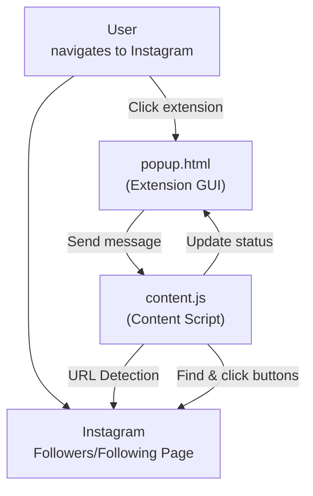
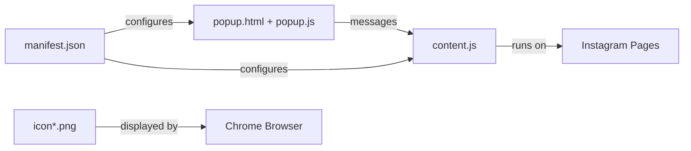

# 📸 Instagram Bot - Chrome Extension

A Chrome extension for Instagram automation that works directly in your browser. Follow and unfollow users with precise control while using your real Instagram session.

## 🎨 Interface Preview

The extension features a **vintage Windows-style popup interface** with:
- **Blue title bar** with "Instagram Bot" branding
- **Vintage gray background** with thick borders
- **Monospace font** for that retro computer feel
- **Real-time status updates** with timestamps
- **Smart page detection** showing current Instagram page type

### Extension Icon
- **Instagram-themed icon** with gradient background (pink to purple)
- **Camera symbol** with "A" for automation
- **Multiple sizes:** 16px, 32px, 48px, 128px for different contexts
- **Appears in Chrome toolbar** when installed

### Popup Interface Sections:
- **Page Detection:** Shows "Followers of @username" or "Following of @username"
- **Follow Users:** Input field for number (1-50) + "START FOLLOWING" button
- **Unfollow Users:** Input field for number (1-50) + "START UNFOLLOWING" button  
- **Status Log:** Real-time updates with timestamps and progress indicators

### Interface Screenshots:

#### ✅ **Follow Configuration**

*Chrome extension popup showing the follow interface with page detection and follow controls*

#### ✅ **Unfollow Configuration**  

*Chrome extension popup showing the unfollow interface with page detection and unfollow controls*

### Interface States:

*Note: See the screenshots above for actual interface appearance. The ASCII art below shows the basic layout structure.*

#### ✅ **Ready State (Followers Page)**
```
┌─────────────────────────┐
│ Instagram Bot           │
├─────────────────────────┤
│ ✅ Ready to follow users│
│                         │
│ CURRENT PAGE            │
│ Followers of @username  │
│                         │
│ FOLLOW USERS            │
│ Number to follow: [10]  │
│ [START FOLLOWING]       │
│                         │
│ STATUS                  │
│ Ready to follow users   │
└─────────────────────────┘
```

#### ✅ **Ready State (Following Page)**
```
┌─────────────────────────┐
│ Instagram Bot           │
├─────────────────────────┤
│ ✅ Ready to unfollow    │
│                         │
│ CURRENT PAGE            │
│ Following of @username  │
│                         │
│ UNFOLLOW USERS          │
│ Number to unfollow: [10]│
│ [START UNFOLLOWING]     │
│                         │
│ STATUS                  │
│ Ready to unfollow users │
└─────────────────────────┘
```

#### ⚠️ **Working State (During Automation)**
```
┌─────────────────────────┐
│ Instagram Bot           │
├─────────────────────────┤
│ ⏳ Following @user123   │
│                         │
│ CURRENT PAGE            │
│ Followers of @username  │
│                         │
│ FOLLOW USERS            │
│ Number to follow: [10]  │
│ [START FOLLOWING]       │
│                         │
│ STATUS                  │
│ [6:15:30 PM] ✅ Followed│
│ @user123 (3/10)        │
│ ⏳ Waiting 1.8s...      │
└─────────────────────────┘
```

---

## 🚀 Why Chrome Extension? (Design Choices)

- **Natural Integration:** Works with your existing Instagram session - no separate login needed
- **Real Browser Session:** Uses your actual Chrome browser, making actions appear completely natural
- **Manual Control:** You navigate to the pages you want to automate, giving you full control
- **No Detection:** Since it uses your real browser session and you manually navigate, it's virtually undetectable
- **Simple Setup:** Just install the extension and you're ready to go
- **Privacy First:** No data ever leaves your browser, everything runs locally

---

## 🛠️ How It Works

### Chrome Extension Workflow

1. **Install the Extension:** Load the extension into Chrome
2. **Navigate to Instagram:** Log into Instagram normally in your browser
3. **Go to Target Page:**
   - **For Following:** Navigate to any user's followers page (`instagram.com/USERNAME/followers/`)
   - **For Unfollowing:** Navigate to your own following page (`instagram.com/YOUR_USERNAME/following/`)
4. **Open Extension:** Click the extension icon in Chrome
5. **Set Count & Start:** Enter the number of users and click start
6. **Automated Actions:** The extension follows/unfollows the exact number you specified

---

## 🗂️ File & Component Overview

- `manifest.json` — Chrome extension configuration with icon references
- `popup.html` — Extension popup interface (vintage Windows style)
- `popup.js` — Popup logic and user interface handling
- `content.js` — Content script that runs on Instagram pages and performs automation
- `icon16.png`, `icon32.png`, `icon48.png`, `icon128.png` — Extension icons

---

## 🔄 Information Flow



---

## 🧩 Component Relationships



---

## 🖥️ How to Use

### Installation

1. **Download/Clone this repository**
2. **Open Chrome and go to:** `chrome://extensions/`
3. **Enable "Developer mode"** (toggle in top right)
4. **Click "Load unpacked"** and select the `chrome-extension` folder
5. **The extension icon will appear** in your Chrome toolbar

### Usage

1. **Login to Instagram** in Chrome normally
2. **Navigate to the target page:**
   - **To Follow:** Go to any user's profile → Click "followers" (URL should be `instagram.com/USERNAME/followers/`)
   - **To Unfollow:** Go to your own profile → Click "following" (URL should be `instagram.com/YOUR_USERNAME/following/`)
3. **Click the extension icon** in Chrome toolbar
4. **The popup will detect the page type** and show appropriate options
5. **Enter the number** of users to follow/unfollow (1-50)
6. **Click START** and watch the automation work
7. **Monitor progress** in the status area

---

## ⚙️ Technical Details

### Page Detection System
- **URL-Based Detection:** Primary method checks URL for `/followers/` or `/following/`
- **Works for Any Account:** `instagram.com/ANY_USERNAME/followers/` pattern
- **Fallback Button Detection:** If URL detection fails, checks for follow/following buttons
- **Real-time Feedback:** Console logging shows detection process

### Follow/Unfollow Logic
- **Exact Count:** Follows/unfollows exactly the number you specify
- **Random Delays:** 0.7-2.5 second random delays between actions (human-like behavior)
- **Smart Button Detection:** Targets Instagram's specific button classes (`_ap3a _aaco _aacw _aad6 _aade`)
- **Username Extraction:** Multiple methods to extract usernames from page elements
- **Smart Scrolling:** Automatically scrolls to find more users if needed

### Button Detection
- **Instagram-Specific:** Targets buttons with Instagram's actual HTML structure
- **Text Filtering:** Looks for "Follow" vs "Following" text in button elements
- **Multiple Fallbacks:** Several methods to find and interact with buttons
- **Error Handling:** Graceful handling of missing elements or Instagram changes

### Safety Features
- **Session Management:** Uses your real browser session (no separate login)
- **Manual Navigation:** You control which pages to automate
- **Random Delays:** 0.7-2.5 second random intervals prevent detection
- **Status Updates:** Real-time feedback on progress with timestamps
- **Error Handling:** Graceful handling of missing elements or Instagram changes

---

## 📦 Extension Structure

### Files
- `manifest.json` - Extension permissions and configuration with icon references
- `popup.html` - User interface with vintage Windows styling
- `popup.js` - Interface logic and Chrome extension messaging
- `content.js` - Instagram page automation logic with URL detection
- `icon16.png`, `icon32.png`, `icon48.png`, `icon128.png` - Extension icons

### Permissions
- `activeTab` - Access to current Instagram tab
- `storage` - Save extension settings (if needed)

---

## 🚨 Usage Instructions

### To Follow Users:
1. Go to any Instagram user's profile (e.g., `instagram.com/1001tracklists/`)
2. Click "followers" to open the followers list (URL becomes `instagram.com/1001tracklists/followers/`)
3. Click the extension icon
4. Enter number to follow and click "START FOLLOWING"

### To Unfollow Users:
1. Go to your own Instagram profile  
2. Click "following" to open your following list (URL becomes `instagram.com/YOUR_USERNAME/following/`)
3. Click the extension icon
4. Enter number to unfollow and click "START UNFOLLOWING"

---

## 🛡️ Safety & Detection

- **Undetectable:** Uses your real browser session and manual navigation
- **Random Delays:** 0.7-2.5 second random delays mimic human behavior
- **No Automation Detection:** Since you manually navigate and use real session
- **Rate Limit Aware:** Stops if Instagram blocks actions
- **Manual Override:** You can stop automation at any time by closing the popup

---

## 🔧 Debugging

### Console Debugging
- **Open Developer Tools:** Press F12 on Instagram page
- **Check Console:** Look for debug messages with 🔍, ✅, ❌ emojis
- **Test Functions:** Type `testUrlDetection()` or `debugPageDetection()` in console
- **Monitor Status:** Watch real-time status updates in extension popup

### Common Issues
- **"Could not detect page type":** Make sure you're on a followers/following page with correct URL
- **"No follow buttons found":** Instagram may have changed button structure
- **Extension not loading:** Check that you loaded the `chrome-extension` folder, not the main folder

---

## ⚠️ Important Notes

- **Manual Navigation Required:** You must manually navigate to the Instagram page you want to automate
- **Real Session:** Uses your actual Instagram login session
- **Rate Limits:** Instagram may still apply rate limits for excessive actions
- **Page Refresh:** If Instagram refreshes the page, just reopen the extension
- **Browser Required:** Must use Chrome browser with extension installed
- **URL Pattern:** Must be on page with URL pattern `instagram.com/USERNAME/followers/` or `instagram.com/USERNAME/following/`

---

## ⚠️ Disclaimer

This tool is for educational and personal use only. Use responsibly and in accordance with Instagram's terms of service. The extension works with your real Instagram account, so exercise caution with the number of actions performed. 