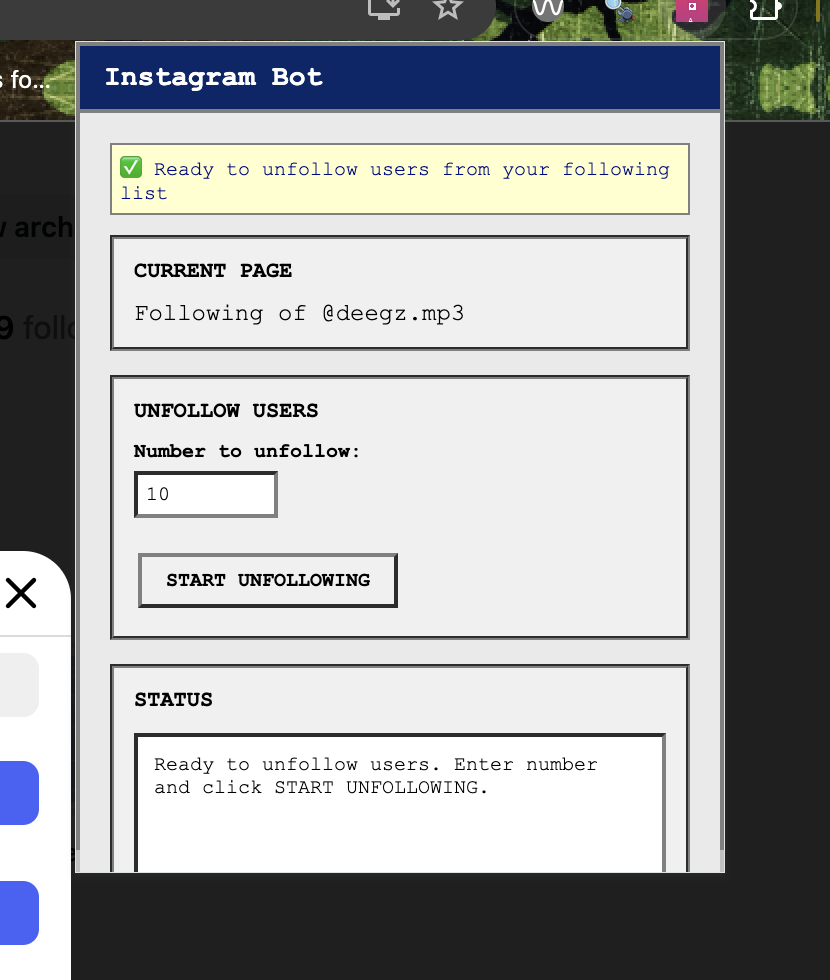
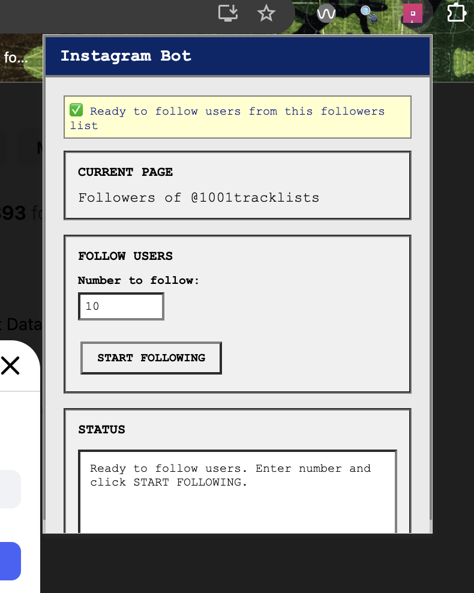
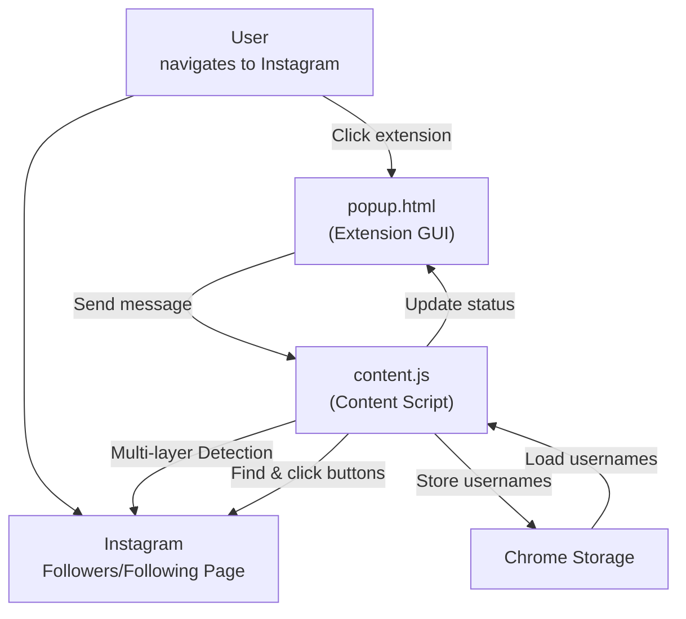
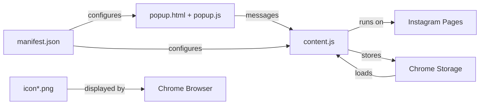

# 📸 Instagram Bot - Chrome Extension

A Chrome extension for Instagram automation that works directly in your browser. Follow and unfollow users with precise control while using your real Instagram session. **Now with intelligent private account detection!**

## 🎨 Interface Preview

The extension features a **vintage Windows-style popup interface** with:
- **Blue title bar** with "Instagram Bot" branding
- **Vintage gray background** with thick borders
- **Monospace font** for that retro computer feel
- **Real-time status updates** with timestamps
- **Smart page detection** showing current Instagram page type
- **Batch management** showing followed batches with auto-deletion
- **Smart batch system** that automatically removes empty batches
- **Private account detection** that automatically skips private accounts during follow operations

### Extension Icon
- **Instagram-themed icon** with gradient background (pink to purple)
- **Camera symbol** with "A" for automation
- **Multiple sizes:** 16px, 32px, 48px, 128px for different contexts
- **Appears in Chrome toolbar** when installed

### Popup Interface Sections:
- **Page Detection:** Shows "Followers of @username" or "Following of @username"
- **Follow Users:** Input field for number (1-50) + "START FOLLOWING" button + private account info
- **Unfollow Users:** Batch selection dropdown + "START UNFOLLOWING" button  
- **Followed Batches:** Shows batch count and total users with auto-deletion
- **Status Log:** Real-time updates with timestamps and progress indicators including private account handling

### Interface Screenshots:

#### ✅ **Follow Configuration**

*Chrome extension popup showing the follow interface with page detection and follow controls*

#### ✅ **Unfollow Configuration**  

*Chrome extension popup showing the unfollow interface with page detection and unfollow controls*

### Interface States:

*Note: See the screenshots above for actual interface appearance. The ASCII art below shows the basic layout structure.*

#### ✅ **Ready State (Followers Page)**
```
┌─────────────────────────┐
│ Instagram Bot           │
├─────────────────────────┤
│ ✅ Ready to follow users│
│                         │
│ CURRENT PAGE            │
│ Followers of @username  │
│                         │
│ FOLLOW USERS            │
│ Number to follow: [10]  │
│ [START FOLLOWING]       │
│                         │
│ FOLLOWED BATCHES        │
│ 1 batches, 15 users     │
│                         │
│ STATUS                  │
│ Ready to follow users   │
└─────────────────────────┘
```

#### ✅ **Ready State (Following Page)**
```
┌─────────────────────────┐
│ Instagram Bot           │
├─────────────────────────┤
│ ✅ Ready to unfollow    │
│                         │
│ CURRENT PAGE            │
│ Following of @username  │
│                         │
│ UNFOLLOW USERS          │
│ Select batch: [Batch 1] │
│ [START UNFOLLOWING]     │
│                         │
│ FOLLOWED BATCHES        │
│ 1 batches, 15 users     │
│                         │
│ STATUS                  │
│ Ready to unfollow users │
└─────────────────────────┘
```

#### ⚠️ **Working State (During Automation)**
```
┌─────────────────────────┐
│ Instagram Bot           │
├─────────────────────────┤
│ ⏳ Following @user123   │
│                         │
│ CURRENT PAGE            │
│ Followers of @username  │
│                         │
│ FOLLOW USERS            │
│ Number to follow: [10]  │
│ [START FOLLOWING]       │
│                         │
│ FOLLOWED BATCHES        │
│ 1 batches, 18 users     │
│                         │
│ STATUS                  │
│ [6:15:30 PM] ✅ Followed│
│ @user123 (3/10)        │
│ ⏳ Waiting 1.8s...      │
└─────────────────────────┘
```

---

## 🚀 Why Chrome Extension? (Design Choices)

- **Natural Integration:** Works with your existing Instagram session - no separate login needed
- **Real Browser Session:** Uses your actual Chrome browser, making actions appear completely natural
- **Manual Control:** You navigate to the pages you want to automate, giving you full control
- **No Detection:** Since it uses your real browser session and you manually navigate, it's virtually undetectable
- **Simple Setup:** Just install the extension and you're ready to go
- **Privacy First:** No data ever leaves your browser, everything runs locally
- **Username Storage:** Remembers who you followed for targeted unfollowing

---

## 🛠️ How It Works

### Chrome Extension Workflow

1. **Install the Extension:** Load the extension into Chrome
2. **Navigate to Instagram:** Log into Instagram normally in your browser
3. **Go to Target Page:**
   - **For Following:** Navigate to any user's followers page (`instagram.com/USERNAME/followers/`)
   - **For Unfollowing:** Navigate to your own following page (`instagram.com/YOUR_USERNAME/following/`)
4. **Open Extension:** Click the extension icon in Chrome
5. **Set Count & Start:** Enter the number of users and click start
6. **Automated Actions:** The extension follows/unfollows the exact number you specified
7. **Username Storage:** Followed usernames are stored for targeted unfollowing

### Enhanced Page Detection System

The extension uses a **multi-layered detection approach** to reliably identify Instagram pages:

#### **1. URL-Based Detection (Primary)**
- **Followers:** Checks for `/followers/` in URL pattern
- **Following:** Checks for `/following/` in URL pattern
- **Username Extraction:** Extracts account name from URL
- **Works for Any Account:** `instagram.com/ANY_USERNAME/followers/` pattern

#### **2. Modal Dialog Detection (Fallback)**
- **Modal Content:** Checks Instagram's modal dialog for "followers" or "following" text
- **Dynamic Content:** Handles Instagram's dynamic modal loading
- **Text Analysis:** Searches modal text content for page type indicators

#### **3. Button Detection (Fallback)**
- **Follow Buttons:** Searches for buttons with "Follow" text (not "Following")
- **Following Buttons:** Searches for buttons with "Following" text
- **Multiple Methods:** Direct text matching + nested div structure scanning
- **Comprehensive Logging:** Shows exactly what buttons are found

#### **4. Page Title Detection (Final Fallback)**
- **Title Analysis:** Checks document.title for "followers" or "following"
- **Case Insensitive:** Handles any capitalization
- **Last Resort:** Used when other methods fail

#### **5. Ultimate Fallback**
- **All Buttons Scan:** Checks every button on page for "Follow" text
- **Detailed Logging:** Shows button text for debugging
- **Robust Detection:** Ensures detection even with Instagram changes

### Advanced Button Detection

The extension uses **intelligent button detection** that adapts to Instagram's changing HTML:

#### **Text-Based Detection**
```javascript
// Looks for exact "Follow" text (not "Following")
buttonText === 'follow'
```

#### **Nested Structure Detection**
```javascript
// Searches div elements within buttons
div.textContent.toLowerCase().trim() === 'follow'
```

#### **Multiple Fallback Methods**
- **Method 1:** Direct button text matching
- **Method 2:** Div structure scanning
- **Method 3:** All buttons on page scan
- **Method 4:** Comprehensive logging for debugging

### Username Storage & Targeted Unfollowing

#### **Follow Process:**
1. **Extract Username:** Gets username from button or page elements
2. **Store in Memory:** Adds to `followedUsernames` array
3. **Save to Storage:** Persists to Chrome's local storage
4. **Update UI:** Shows count in "FOLLOWED LIST" section

#### **Unfollow Process:**
1. **Load Stored List:** Retrieves usernames from storage
2. **Targeted Unfollowing:** Only unfollows users from stored list
3. **Remove from List:** Deletes username after successful unfollow
4. **Update Count:** Shows updated count in UI

---

## 🔍 Private Account Detection Feature

### What It Does
The extension now **intelligently detects the difference between public and private Instagram accounts** during follow operations, ensuring you only follow public accounts while automatically handling private accounts.

### How It Works
1. **Button State Monitoring:** After clicking "Follow", the extension monitors button text changes
2. **Public Account Detection:** 
   - Button changes from "Follow" → "Following"
   - Account is successfully followed and added to batch
   - Counts toward your follow goal ✅
3. **Private Account Detection:**
   - Button changes from "Follow" → "Requested" 
   - Account is automatically unfollowed immediately
   - Not added to batch, doesn't count toward goal 🔄

### Benefits
- **No Pending Requests:** Private account follow requests are automatically removed
- **Clean Account Status:** Your Instagram account stays clean with no pending requests
- **Accurate Follow Counts:** Only public accounts count toward your follow target
- **Better Instagram Health:** Avoids accumulating pending requests that can hurt account reputation
- **Automatic Cleanup:** No manual intervention needed for private accounts
- **Smart Batch Management:** Only public accounts are stored in batches for later unfollowing

### Example Workflow
```
User clicks "Follow" on @user123
↓
Extension waits 1.5 seconds for button update
↓
Button shows "Following" → Public account ✅
OR
Button shows "Requested" → Private account, auto-unfollowed 🔄
```

### Status Messages
During operation, you'll see status updates like:
- `✅ Followed @username (public account) (1/10)`
- `⚠️ @username is private, unfollowing...`
- `🔄 Unfollowed @username (private account) - 2 private accounts removed`
- `🎉 Successfully followed 8 public users! (2 private accounts were skipped)`

---

## 📦 Extension Structure

- `manifest.json` — Chrome extension configuration with icon references and storage permissions
- `popup.html` — Extension popup interface (vintage Windows style)
- `popup.js` — Popup logic, UI handling, and Chrome storage management
- `content.js` — Content script with enhanced page detection and button finding
- `icon16.png`, `icon32.png`, `icon48.png`, `icon128.png` — Extension icons

---

## 🔄 Information Flow



---

## 🧩 Component Relationships



---

## 🖥️ How to Use

### Installation

1. **Download/Clone this repository**
2. **Open Chrome and go to:** `chrome://extensions/`
3. **Enable "Developer mode"** (toggle in top right)
4. **Click "Load unpacked"** and select the `chrome-extension` folder
5. **The extension icon will appear** in your Chrome toolbar

### Usage

1. **Login to Instagram** in Chrome normally
2. **Navigate to the target page:**
   - **To Follow:** Go to any user's profile → Click "followers" (URL should be `instagram.com/USERNAME/followers/`)
   - **To Unfollow:** Go to your own profile → Click "following" (URL should be `instagram.com/YOUR_USERNAME/following/`)
3. **Click the extension icon** in Chrome toolbar
4. **The popup will detect the page type** and show appropriate options
5. **Enter the number** of users to follow/unfollow (1-50)
6. **Click START** and watch the automation work
7. **Monitor progress** in the status area
8. **Check "FOLLOWED LIST"** to see stored usernames count

---

## ⚙️ Technical Details

### Enhanced Page Detection System
- **Multi-Layer Detection:** URL → Modal → Buttons → Title → Ultimate Fallback
- **URL-Based Detection:** Primary method checks URL for `/followers/` or `/following/`
- **Modal Dialog Analysis:** Checks Instagram's modal content for page type
- **Button Detection:** Multiple methods to find follow/following buttons
- **Comprehensive Logging:** Detailed console output for debugging
- **Real-time Feedback:** Shows detection process in console

### Advanced Button Detection
- **Text-Based Detection:** Looks for exact "Follow" vs "Following" text
- **Nested Structure Scanning:** Searches div elements within buttons
- **Multiple Fallback Methods:** Several approaches to find buttons
- **Detailed Logging:** Shows button text and detection process
- **Robust Against Changes:** Adapts to Instagram's dynamic HTML

### Follow/Unfollow Logic
- **Exact Count:** Follows/unfollows exactly the number you specify
- **Random Delays:** 0.7-2.5 second random delays between actions (human-like behavior)
- **Username Storage:** Stores followed usernames in Chrome's local storage
- **Targeted Unfollowing:** Only unfollows users from stored list
- **Smart Scrolling:** Automatically scrolls to find more users if needed
- **Progress Tracking:** Real-time status updates with timestamps

### Batch Management System
- **Chrome Storage:** Uses `chrome.storage.local` for persistence
- **Batch Array:** Maintains `followedBatches` array with timestamps and usernames
- **Automatic Saving:** Saves after each successful follow
- **Targeted Unfollowing:** Only attempts to unfollow users from selected batch
- **Auto-Deletion:** Automatically removes batches when they become empty
- **UI Integration:** Shows batch count and provides batch selection dropdown

### Safety Features
- **Session Management:** Uses your real browser session (no separate login)
- **Manual Navigation:** You control which pages to automate
- **Random Delays:** 0.7-2.5 second random intervals prevent detection
- **Status Updates:** Real-time feedback on progress with timestamps
- **Error Handling:** Graceful handling of missing elements or Instagram changes
- **Rate Limit Awareness:** Stops if Instagram blocks actions

---

## 📦 Extension Structure

### Files
- `manifest.json` - Extension permissions and configuration with storage access
- `popup.html` - User interface with vintage Windows styling and followed list
- `popup.js` - Interface logic, Chrome messaging, and storage management
- `content.js` - Instagram page automation with enhanced detection and username storage
- `icon16.png`, `icon32.png`, `icon48.png`, `icon128.png` - Extension icons

### Permissions
- `activeTab` - Access to current Instagram tab
- `storage` - Save and load followed usernames across sessions

---

## 🚨 Usage Instructions

### To Follow Users:
1. Go to any Instagram user's profile (e.g., `instagram.com/1001tracklists/`)
2. Click "followers" to open the followers list (URL becomes `instagram.com/1001tracklists/followers/`)
3. Click the extension icon
4. Enter number to follow and click "START FOLLOWING"
5. The extension automatically detects public vs private accounts:
   - **Public accounts:** Successfully followed and added to batch ✅
   - **Private accounts:** Automatically skipped and not added to batch 🔄
6. Watch the "FOLLOWED BATCHES" count increase (only public accounts are counted)

### To Unfollow Users:
1. Go to your own Instagram profile  
2. Click "following" to open your following list (URL becomes `instagram.com/YOUR_USERNAME/following/`)
3. Click the extension icon
4. Select a batch from the dropdown and click "START UNFOLLOWING"
5. Only users from the selected batch will be unfollowed
6. Batches automatically delete when they become empty

### Private Account Handling:
- **Automatic Detection:** The extension monitors button state changes after clicking "Follow"
- **Public Accounts:** Button changes to "Following" → Account is followed and stored in batch
- **Private Accounts:** Button changes to "Requested" → Account is automatically unfollowed
- **Clean Status:** No pending follow requests accumulate from private accounts
- **Accurate Counts:** Only public accounts count toward your follow goal and are stored in batches

---

## 🛡️ Safety & Detection

- **Undetectable:** Uses your real browser session and manual navigation
- **Random Delays:** 0.7-2.5 second random delays mimic human behavior
- **Smart Account Filtering:** Automatically detects and skips private accounts
- **No Pending Requests:** Private account follow requests are immediately removed
- **No Automation Detection:** Since you manually navigate and use real session
- **Rate Limit Aware:** Stops if Instagram blocks actions
- **Manual Override:** You can stop automation at any time by closing the popup
- **Username Storage:** Targeted unfollowing reduces unnecessary actions
- **Clean Account Status:** Maintains clean Instagram account with no pending requests
- **Accurate Follow Counts:** Only counts actual public account follows, not pending requests

---

## 🔧 Debugging

### Console Debugging
- **Open Developer Tools:** Press F12 on Instagram page
- **Check Console:** Look for debug messages with 🔍, ✅, ❌ emojis
- **Test Functions:** Type `testPageDetection()` or `testUrlDetection()` in console
- **Monitor Status:** Watch real-time status updates in extension popup

### Enhanced Debugging Functions
- **`testPageDetection()`:** Comprehensive page detection test with detailed logging
- **`testUrlDetection()`:** URL pattern matching test
- **`debugPageDetection()`:** Basic page detection debugging
- **Button Detection Logs:** Shows button text and detection methods used

### Common Issues & Solutions
- **"Could not detect page type":** 
  - Reload the extension
  - Refresh the Instagram page
  - Wait for modal to fully load
  - Run `testPageDetection()` in console
- **"No follow buttons found":** 
  - Instagram may have changed button structure
  - Check console for button detection logs
  - Try the ultimate fallback method
- **Extension not loading:** 
  - Check that you loaded the `chrome-extension` folder
  - Enable developer mode in Chrome
  - Reload the extension

### Debugging Sequence
1. **Reload extension** → `chrome://extensions/` → refresh icon
2. **Refresh Instagram page** → wait for modal to load
3. **Open console** → run `testPageDetection()`
4. **Check button logs** → look for "🔍 Button text:" messages
5. **Monitor detection** → watch for "✅ DETECTED:" messages

---

## ⚠️ Important Notes

- **Manual Navigation Required:** You must manually navigate to the Instagram page you want to automate
- **Real Session:** Uses your actual Instagram login session
- **Rate Limits:** Instagram may still apply rate limits for excessive actions
- **Page Refresh:** If Instagram refreshes the page, just reopen the extension
- **Browser Required:** Must use Chrome browser with extension installed
- **URL Pattern:** Must be on page with URL pattern `instagram.com/USERNAME/followers/` or `instagram.com/USERNAME/following/`
- **Batch Storage:** Only successfully followed public accounts are stored in batches with timestamps
- **Auto-Deletion:** Batches automatically delete when they become empty
- **Private Account Handling:** Private accounts are automatically detected and skipped, maintaining clean account status
- **No Pending Requests:** The extension automatically removes private account follow requests to keep your Instagram account clean

---

## ⚠️ Disclaimer

This tool is for educational and personal use only. Use responsibly and in accordance with Instagram's terms of service. The extension works with your real Instagram account, so exercise caution with the number of actions performed. Batch storage is local to your browser and not shared with any external services. 